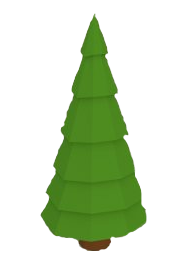
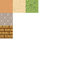

#Resources

#### Libraries
- [SFML](https://www.sfml-dev.org/)
    A graphics library that focuses on 2D

#### Assets
- [Low poly tree](https://free3d.com/3d-model/low-poly-tree-73217.html)
      
- [Ground](https://opengameart.org/content/ground-tiles-1
)
      

- [Characters](https://opengameart.org/content/pixel-characters-tiles-ai
)

#### Techniques
- [Fog of war](https://en.sfml-dev.org/forums/index.php?topic=7427.0)
